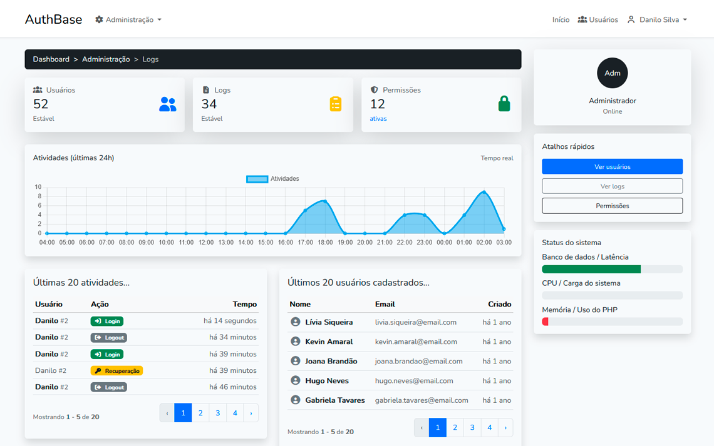

# AuthBase

Projeto base para **controle de acesso e gerenciamento de usuários** usando Laravel. Este repositório contém a estrutura mínima para iniciar um sistema com autenticação, migrations e configuração básica.

---

## Preview   



---

## Requisitos

- PHP 8.0+ (verifique a versão compatível com sua versão do Laravel)
- Composer
- MySQL / MariaDB (ou outro banco suportado pelo Laravel)
- Node.js + npm (se for compilar assets/front)
- Git

---

## Clonar o repositório

```bash
# clone o repositório (cole a URL do seu repo)
git clone <URL_DO_SEU_REPOSITORIO>
cd nome-do-repositorio
```
---

## Instalação 

Veja as instruções completas no arquivo:

[INSTALL.md](./INSTALL.md)

---

## Desenvolvido por

Desenvolvido por Danilo Cavalcante

